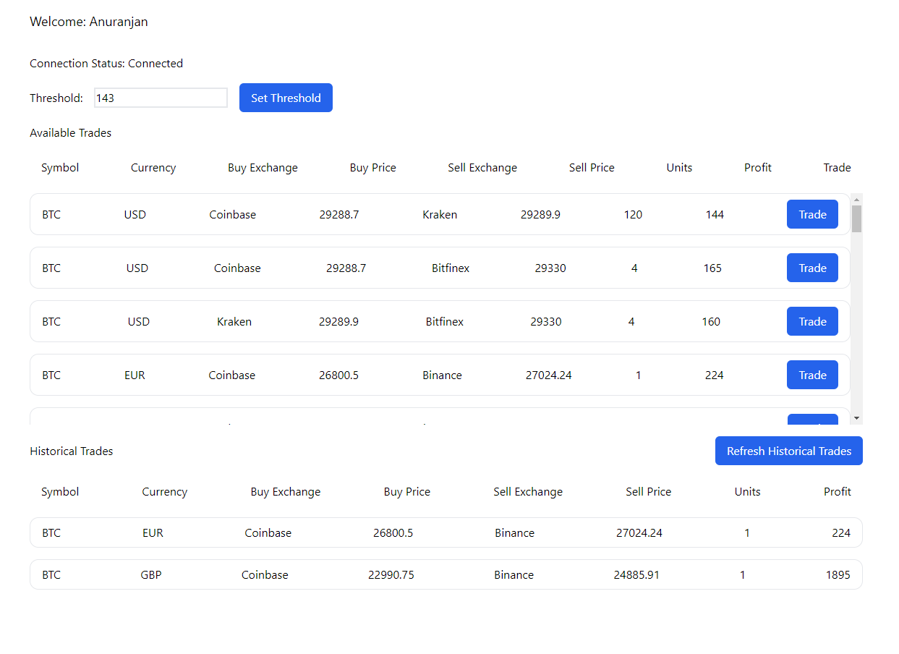
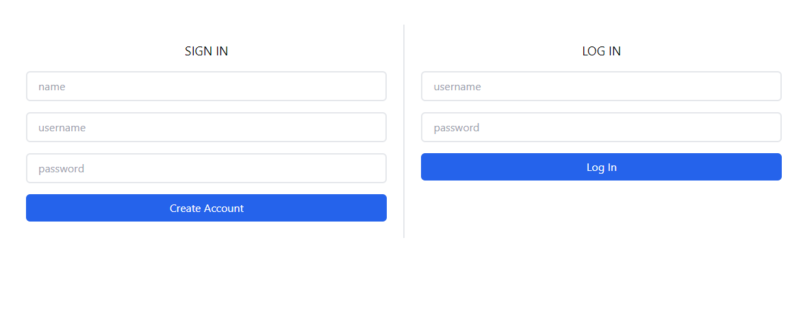

# Arbitrage Python-Flask microservices

A collection of flask microservices and react frontend to make arbitrage trades

## API

## Installation

Clone the library. create python venv in each microservices

- auth-service
- arbitrage-service
- trade-service

```bash
python -m venv venv
```

In frontend folder, run `yarn install`

## Usage

To run flask microservices, in each folder, run development server using `python run.py` in each service
To run the frontend app, in frontend folder, run `yarn run dev`

## Configuration

Configuration for every flask app is in `<folder>/app/__init__.py -> create_app()`

## Screenshots

### Home Screen



### Login Screen



## TODO (in priority order)

- [ ] Update code documentation
- [ ] Fix 2.3s API response from frontend
- [ ] Add Auth to arbitrage-service
