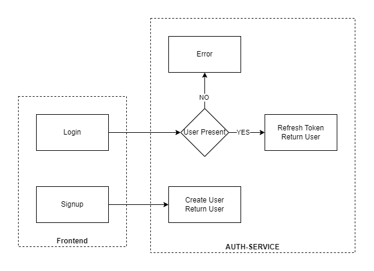
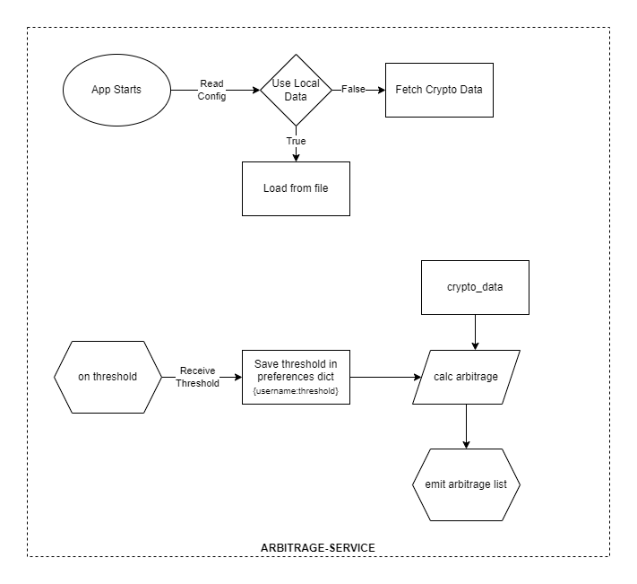
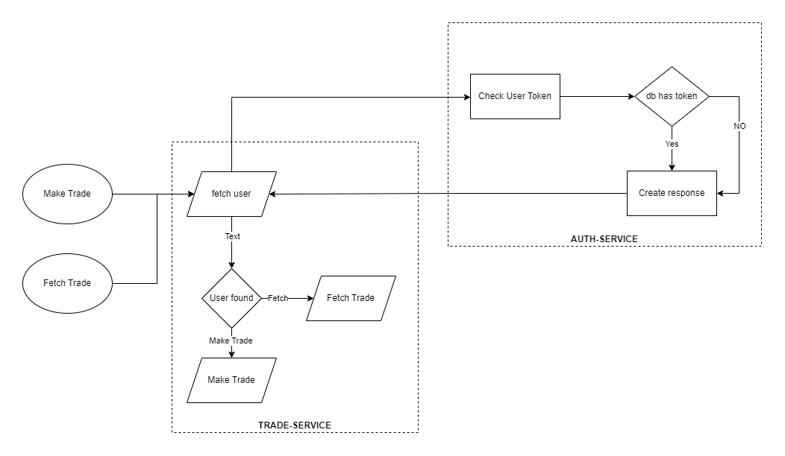

# Arbitrage Python-Flask microservices

A collection of flask microservices and react frontend to make arbitrage trades

It calculates Cross exchange arbitrage possibilities with multiple symbols, currencies and exchanges.

Grouping is done on Symbols and Currencies

Sample (not a representation of internal structure)

```json
{
  "BTC": {
    "USD": {
      "Coinbase": "Kraken",
      "Bitfinex": "Kraken"
    }
  }
}
```

## API

[CryptoCompare](https://www.cryptocompare.com)

## Installation

Clone the library. create python venv in each microservices

- auth-service
- arbitrage-service
- trade-service

```bash
python -m venv venv
```

In frontend folder, run `yarn install`

## Usage

To run flask microservices, in each folder, run development server using `python run.py` in each service
To run the frontend app, in frontend folder, run `yarn run dev`

### Routes

- Arbitrage Service: http://localhost:5001
- Trade Service: http://localhost:5002
- Auth Service: http://localhost:5003
- Fronetend: http://localhost:5173

## Configuration

Configuration for every flask app is in `<folder>/app/__init__.py -> create_app()`

## Folder structure

```bash
flask-service               # root folder
├─── run.py                 # main file
├─── requirements.txt       # pip requirements
├─── .env                   # env config
└─── app                    # src folder
  ├─── __init__.py          # init file primarily contains flask app factory for main file
  ├─── models.py            # db models and dataclasses
  ├─── util.py              # utility functions for business logic
  └─── flask-api            # controller folder
    ├─── __init__.py        # init file primarily containing blueprints and routes/events
    ├─── routes.py          # http routes
    └─── events.py          # SocketIO events
      └─── api              # external API handling
        ├─── __init__.py
        └─── ApiClient.py   # class with static methods for fetching API data
```

## Flow Diagram

### Login Flow



### Arbitrage Flow



### Trade Flow



## Screenshots

### Home Screen


### Login Screen


## TODO (in priority order)

- [x] Update code documentation
- [ ] Refresh crypto data regularly
- [ ] Fix 2.3s API response from frontend
- [ ] Order historical data by timestamp in frontend
- [ ] Add Auth to arbitrage-service
- [ ] Frontend trade and historical tables should have filters, pagination and column sorting
